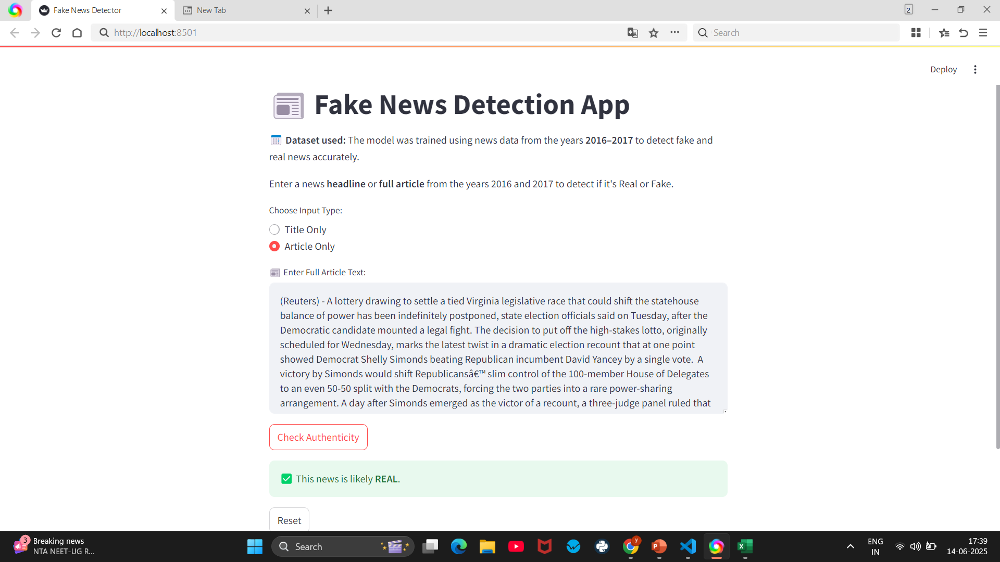
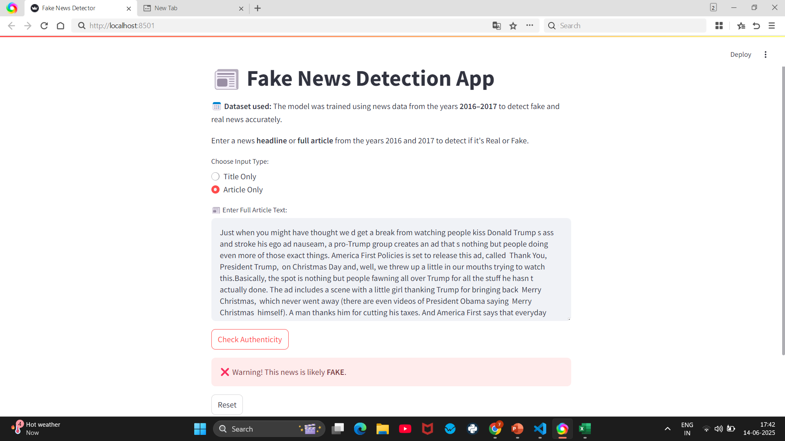

# 📰 Fake News Detection App

This is an AI-based Fake News Detection system built using Python, Machine Learning, and a responsive Streamlit interface.

## 📌 Features
- Classifies news as **Real** or **Fake**
- Input via **Title** or **Full Article**
- Real-time prediction with Streamlit
- Separate models trained on **2016–2017** dataset

## 🛠️ Tech Stack
- Python
- Scikit-learn
- Pandas, NumPy
- TF-IDF Vectorization
- Streamlit

## 📦 Installation
To install the required packages:

```bash
pip install -r requirements.txt

## 📸 Screenshots

### ✅ Real News Prediction


### ❌ Fake News Prediction

